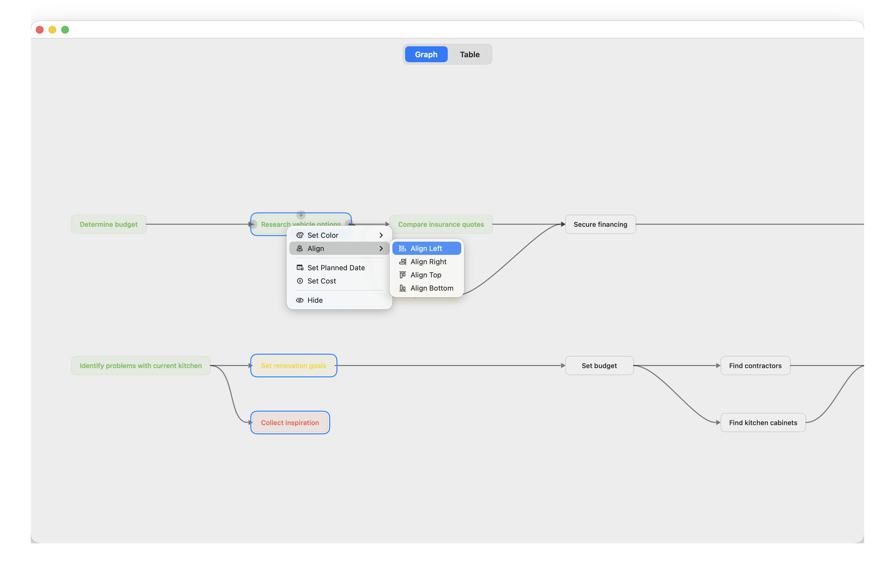

# Domino

A lightweight mind map app for macOS, built with SwiftUI and Swift Package Manager.



## Features

- **Infinite canvas** with pan and pinch-to-zoom
- **Double-click** anywhere to create a node
- **Drag from edge handles** to create child nodes or connect existing nodes
- **Directed edges** with curved arrows between connected nodes
- **Click to select**, click again to edit text inline
- **Node colors** via right-click context menu (presets + custom color picker)
- **Undo/Redo** (Cmd+Z / Cmd+Shift+Z, up to 50 levels)
- **Save/Open** mind maps as JSON (Cmd+S, Cmd+O)
- **Delete** nodes or edges with the Delete key (children get reparented automatically)
- **Depth badges** showing each node's distance from root nodes

## Requirements

- macOS 14+
- Swift 6.0+

## Build & Run

```
swift run Domino
```
