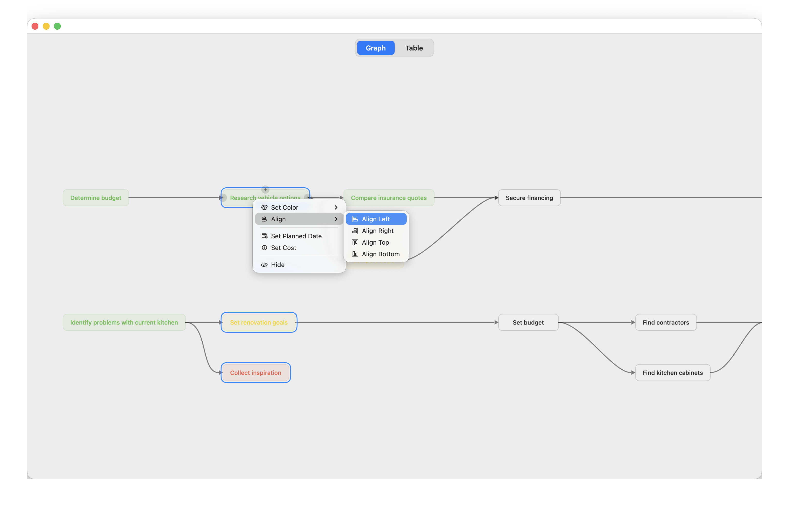

<div align="center">


# Domino

Native Mac app for life planning using dependency graphs

[](https://github.com/razeghi71/domino/releases/latest/download/Domino.zip)



</div>

## Features

### Visual Task Mapping

Double-click anywhere on the infinite canvas to create a task node. Pan with two fingers, pinch to zoom, and hit **⌘0** whenever you need to snap back to everything at once.

### Dependency Arrows

Hover any task and you'll see four **+** buttons on each side. Drag from a **+** button to an existing task to draw an arrow connecting the two. The arrow means the source task has to be done before the target task can start. You can also click a **+** button without dragging to quickly spawn a new task in that direction, or drag from a **+** onto empty space to place a new task at that spot. Select an arrow and press Delete to remove a connection.

### Planned Dates & Budgets

Right-click a task to set a target date or a budget. Hover a task with a date to see it as a tooltip. Dates and budgets show up in the context menu so you can change or remove them anytime.

### Task Statuses

Mark tasks with colored statuses like "In Progress" or "Done" from the right-click menu. Customize the full status palette under Settings (**⌘,**), picking your own names and colors. Each task's border reflects its current status so you can scan the canvas at a glance.

### Search

Press **⌘F** to find tasks by name. Step through matches with the arrow buttons or Enter. The canvas scrolls to each result so nothing stays hidden.

### Alignment & Snapping

While dragging tasks, guide lines automatically appear to snap them to equal spacing or shared edges. Select multiple tasks, right-click, and pick **Align Left/Right/Top/Bottom** to line them up in one click.

### Hide & Unhide

Right-click a task and choose **Hide** to tuck it away. Toggle **Show Hidden Items** in the View menu when you need to bring hidden tasks back with a dashed border. Great for clearing completed work off the canvas without losing it.

### Depth Ranks

Turn on **Show Node Ranks** in the View menu to display small rank badges on each task. Tasks with no dependencies get rank 0, their direct dependents get rank 1, and so on, giving you a quick sense of how many steps are in a chain.

### Multi-Select

Shift-click to toggle individual tasks in your selection. Click on empty space and drag to draw a selection rectangle around a group. Move, re-status, set dates, hide, or delete the whole group at once.

### Undo / Redo

Every change is snapshotted. **⌘Z** to undo, **⌘⇧Z** to redo, up to 50 levels deep.

### Save & Open

**⌘S** saves your board as a JSON file. **⌘O** opens one. The app warns before discarding unsaved changes. Older Domino files are loaded and migrated automatically.

## Requirements

- macOS 14+
- Swift 6.0+

## Build & Run

Run directly from source:

```
swift run Domino
```

## Install as macOS App

Bundle it into a proper `.app`:

```
./scripts/bundle.sh
```

This builds a release binary and creates `build/Domino.app`. To install:

```
cp -R build/Domino.app /Applications/
```

The app is unsigned, so on first launch you may need to right-click > Open (or allow it in System Settings > Privacy & Security).
